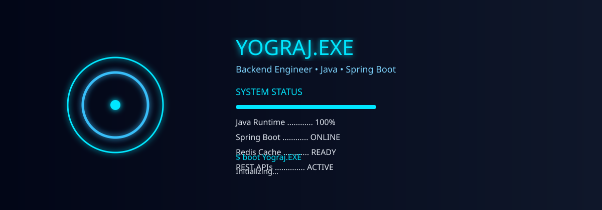

<div align="center">

# ⚡ YOGRAJ.EXE

<p align="center">
  
</p>


</div>

---

# 🖥 BOOT SEQUENCE

```text
boot Yograj.EXE

Loading JVM..................OK
Spring Boot..................OK
MySQL........................OK
Redis Cache..................OK
REST APIs....................READY

STATUS: ONLINE
```

---

## 👨‍💻 ABOUT ME

```yaml
Name: Yograj Tripathi

Role: Backend Engineer

Stack:
  - Java
  - Spring Boot
  - Redis
  - MySQL
  - React

Currently Learning:
  - Kafka
  - Microservices
  - System Design
```

---

# ⚙ TECH ARSENAL

<div align="center">


</div>

---

# 🚀 FEATURED PROJECTS

| Project | Tech |
|---------|------|
| 🚆 Railway Booking System | Spring Boot + JWT + Redis |
| 🌱 Smart Crop Predictor | React + Node.js |
| 📚 Spring Boot Learning | Java + Spring Boot |
| 🧠 Striver DSA Sheet | C++ |

---

# 📊 GITHUB DASHBOARD

<div align="center">


</div>

---

# 🔥 CONTRIBUTION STREAK

<div align="center">


</div>

---

# 📈 ACTIVITY GRAPH

<div align="center">


</div>

---

# 🏆 ACHIEVEMENTS

<div align="center">


</div>

---

# 🎯 CURRENT MISSION

- [x] Spring Boot
- [x] REST APIs
- [x] DSA
- [ ] Redis Mastery
- [ ] Kafka
- [ ] Microservices
- [ ] Product-Based Company

---

# 🌐 CONNECT

<div align="center">

<a href="https://github.com/UniverseOfYograj">

</a>

<a href="https://linkedin.com/in/YOUR_LINKEDIN">

</a>

</div>

---

<div align="center">

### ⚙ Powered by YOGRAJ.EXE

> *Code. Learn. Build. Repeat.*

</div>
